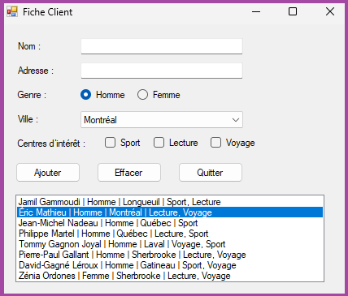
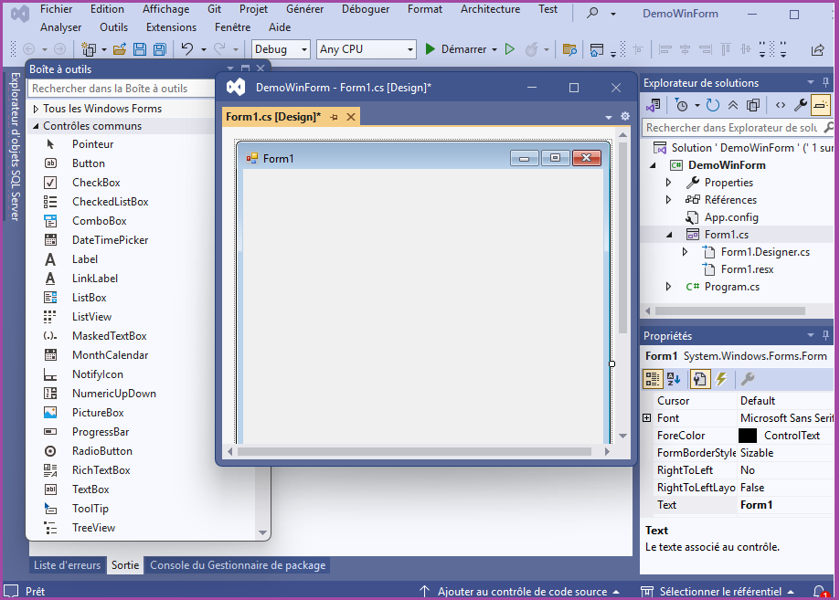
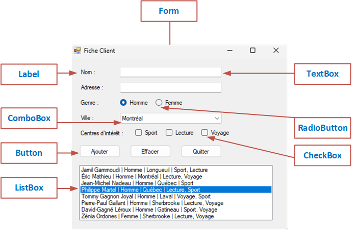

# 12.2 — Remise TP3 et introduction à l'interface graphique (WinForm)

## 🎯 Objectif

Concevoir et développer une application Windows simple avec une interface graphique en utilisant Visual Studio et le framework WinForms de C#.

---

### 🔍 Objectifs spécifiques :

1. **Comprendre les principes de base d’une interface graphique (GUI)** : fenêtres, contrôles, événements, propriétés.
2. **Découvrir l’environnement de développement Visual Studio** pour créer un projet WinForms.
3. **Utiliser les principaux contrôles** (boutons, labels, zones de texte, menus, etc.) pour construire une interface utilisateur.
4. **Gérer les événements** (clics, saisies, etc.) avec le code C#.
5. **Personnaliser l’apparence et le comportement** d’une application Windows.
6. **Compiler et exécuter une application WinForms fonctionnelle.**


---
## 🖥️ **1. Interface graphique (GUI)**

Une interface graphique (**Graphical User Interface**) permet à l’utilisateur d’interagir avec l’ordinateur à l’aide d’éléments visuels comme des fenêtres, boutons, menus ou icônes. Contrairement aux applications console, elle est plus intuitive : l’utilisateur clique, sélectionne ou saisit des données au lieu de taper des commandes. Les interfaces graphiques rendent les applications plus faciles à utiliser et moins sujettes aux erreurs. Dans ce cours, nous utiliserons WinForms en C# pour apprendre à créer des fenêtres, ajouter des contrôles et gérer les actions de l’utilisateur.



---
## 🧩 **2. Structure d’une application WinForms**

Une application **WinForms** est organisée autour de **formulaires**, qui sont des fenêtres servant d’interface avec l’utilisateur. Chaque formulaire correspond à une **classe C#** dérivée de `Form`. L’application démarre avec le **formulaire principal**, et peut ouvrir d’autres formulaires secondaires si nécessaire.

Dans le projet WinForms, on retrouve généralement :

* **Form1.cs** : contient le code logique du formulaire.
* **Form1.Designer.cs** : génère automatiquement le code de l’interface créée avec le concepteur.
* **Program.cs** : point d’entrée du programme, qui lance le formulaire principal via `Application.Run()`.

Le **concepteur graphique** de Visual Studio permet de **placer et configurer visuellement les contrôles** (boutons, zones de texte, étiquettes…), tandis que le **code C#** gère leur comportement et les interactions avec l’utilisateur. Cette organisation sépare clairement **l’interface** du **fonctionnement**, ce qui facilite la création, la lecture et la maintenance de l’application.




---

## 🧱 **3. Les contrôles de base**

Dans une application **WinForms**, les **contrôles** représentent les éléments visuels interactifs qui composent l’interface graphique. Ce sont les objets que l’utilisateur voit et manipule sur le formulaire, tels que les :

* **formulaire (Form)**,
* **bouton (Button)**,
* **étiquette (Label)**,
* **zone de texte (TextBox)**,
* **case à cocher (CheckBox)**,
* **bouton radio (RadioButton)** 
* **liste (déroulantes) (ComboBox et ListBox)**. 

Nous pouvons mettre plusieurs éléments graphiques dans un conteneur. Par exemple, le **GroupBox** sert à regroupe des contrôles liés logiquement (ex. RadioButtons, Labels, TextBox).

>💡 **Ajout du contrôle au formulaire** :
>L’ajout de contrôles se fait facilement dans **Visual Studio** grâce à l’outil de conception visuelle : il suffit de **glisser-déposer** les éléments souhaités depuis la boîte à outils 🧰 vers le formulaire.




---

### ⚙️ **Les propriétés et les méthodes**

Chaque **contrôle** d’une application WinForms possède un ensemble de **propriétés** qui définissent son apparence, sa position et son comportement. Par exemple, une propriété peut indiquer le **texte affiché** sur un bouton (`Text`), la **taille** ou la **couleur** d’un élément (`Size`, `BackColor`), ou encore sa **visibilité** (`Visible`). Ces propriétés peuvent être modifiées de deux manières : soit dans la **fenêtre Propriétés**, soit directement dans le **code**.

Chaque contrôle dispose également d’un ensemble de méthodes permettant d’intervenir sur lui, par exemple pour l’afficher, le masquer ou en actualiser l’affichage.

#### **Quelques propriétés communes à tous les contrôles**
| Propriété            | Description                                                                 | Exemple                                        |      
| -------------------- | --------------------------------------------------------------------------- | ---------------------------------------------- |
| **Name**             | Nom du contrôle (identifiant dans le code).                                 | `btnOk.Name = "btnOk";`                        |     
| **Text**             | Texte affiché (si applicable).                                              | `txtMessage.Text = "Bienvenue";`               |        
| **Enabled**          | Indique si le contrôle est actif (`true`) ou désactivé (`false`).           | `txtNom.Enabled = false;`                      |              
| **Visible**          | Rend le contrôle visible ou invisible.                                      | `txtNom.Visible = true;`                       |              
| **BackColor**        | Couleur d’arrière-plan du contrôle.                                         | `txtNom.BackColor = Color.LightGray;`          | 
| **ForeColor**        | Couleur du texte (si applicable).                                           | `txtNom.ForeColor = Color.DarkBlue;`           |   
| **Size**             | Taille du contrôle (largeur et hauteur).                                    | `txtNom.Size = new Size(100, 30);`             |   

#### **Quelques méthodes communes à tous les contrôles**
| Méthode                               | Description                                                   | Exemple C#                                           |
| ------------------------------------- | ------------------------------------------------------------- | ---------------------------------------------------- |
| **Show()**                            | Affiche le contrôle.                                          | `btnSupprimer.Show();`                               |
| **Hide()**                            | Cache le contrôle.                                            | `btnSupprimer.Hide();`                               |
| **Focus()**                           | Donne le focus (sélection) au contrôle.                       | `btnSupprimer.Focus();`                              |
| **Select()**                          | Similaire à `Focus()`.                                        | `btnSupprimer.Select();`                             |


### 🖱️ **Les événements**

Dans une interface WinForms, les **événements** représentent les actions effectuées par l’utilisateur — comme un **clic sur un bouton**, une **saisie de texte**, ou encore le **chargement d’un formulaire**. Chaque contrôle peut générer différents événements, et le programmeur définit la **réaction du programme** à ces actions en écrivant du code spécifique appelé **gestionnaire d’événement** (*event handler*).

---

#### 🧪 **Exemple**
```csharp
private void btnMessage_Click(object sender, EventArgs e)
{   
    MessageBox.Show("Bonjour !");
}
```
> #### 💡 **Explication**
> - Ici, l’événement `Click` déclenche l’exécution de cette ligne de code pour afficher un message à l’écran. 
> - La méthode **MessageBox.Show** permet d'afficher le message dans une une **boite de dialogue**.  

---
#### **Quelques évènements communs à tous les contrôles**
| Événement                           | Description                                            |
| ------------------------------------|------------------------------------------------------- |
| **Click**                           | Quand on clique sur le contrôle.                       |
| **DoubleClick**                     | Quand on double-clique.                                | 
| **MouseEnter / MouseLeave**         | Quand la souris entre ou quitte le contrôle.           | 
| **MouseDown / MouseUp / MouseMove** | Pour gérer les actions de la souris.                   |
| **KeyDown / KeyUp / KeyPress**      | Pour capter les touches du clavier.                    | 
| **GotFocus / LostFocus**            | Quand le contrôle reçoit ou perd le focus.             | 
| **TextChanged**                     | Quand le texte change (pour les contrôles avec texte). | 

---

## 🧰 **TextBox**

Le TextBox est un **champ de saisie** permettant à l’utilisateur d’entrer du **texte** (comme un nom, une adresse, un mot de passe, etc.).

### **Principales propriétés et méthodes**

| Propriété                           | Description       | Exemple |
|--------------------------------|-----------------------------|--------------------------------|
| Text                           | Contenu du TextBox    | <code>//Récupérer le contenu d'un TextBox<br />string nom = txtNom.Text;<br /> //Modifier le contenu<br />txtNom.Text = "Adam";</code>|
| Visible                        | Afficher ou masuqer le contrôle | <code>//Afficher un TextBox<br />txtNom.Visible = true;<br /> //Masquer un TextBox<br />txtNom.Visible = false;</code>|
| ReadOnly            | Empêcher la modification du texte | <code>txtNom.ReadOnly = true;</code>|
| MaxLength              | Limite le nombre de caractères   | <code>txtNom.MaxLength = 50;</code>|


---
## 🧰 **Button**

Le Button est un contrôle **cliquable** qui permet à l’utilisateur de déclencher une action.
### 🎯 **Exemples de manipulations**
#### ▶️ Associer un bouton à l'évènement clic
````csharp
private void btnMessage_Click(object sender, EventArgs e)
{
    // Récupérer le contenu du contrôle txtNom
    string nom = txtNom.Text
    MessageBox.Show("Bonjour " + nom);
}
````
#### ▶️ Activer ou désactiver un bouton
````csharp
    // Activer un bouton de suppression
    btnSupprimer.Enabled = true;
     // Désactiver un bouton de suppression
    btnMessage.Enabled = false;

````
---
## 🧰 **RadioButton**

Pour manipuler un RadioButton, on utilise surtout la propriété Checked pour savoir s’il est sélectionné et la propriété Text pour récupérer le texte affiché.

### 🎯 **Exemples de manipulations**
#### ▶️ Vérifier si un RadioButton est sélectionné et récupérer son texte
```csharp
    char genre;
    // On veut récupérer le genre du client       
    if (rbFemme.Checked)
    {
        genre= 'F';

    }else if (rbHomme.Checked)
    {
         genre= 'H';
    }else
    {
        MessageBox.Show("Veuillez choisir le genre!");
        return;
    }
```
#### ▶️ Modifier l'état d'un RadioButton avec le code
```csharp
    // Cocher la case   
    rdoFemme.Checked = true;
    // Décocher la case
    rdoFemme.Checked = false;  
```
---
## 🧰 **CheckBox**

Pour manipuler un RadioButton, on utilise surtout la propriété Checked pour savoir s’il est sélectionné et la propriété Text pour récupérer le texte affiché.

### 🎯 **Exemples de manipulations**
#### ▶️ Vérifier si un CheckBox est sélectionné et récupérer son texte
```csharp
    string centreInterets = "";
    // On veut récupérer les centres d'interêts du client       
    if (chkSport.Checked)
    {
        centresInteret += chkSport.Text + ",";

    }else if (chkLecture.Checked)
    {
         centresInteret += chkLecture.Text + ",";

    }else if (chkVoyage.Checked)
    {
         centresInteret += chkVoyage.Text + ",";
    }

```

#### ▶️ Modifier l'état d'un CheckBox avec le code
```csharp
    // Cocher la case   
    chkSport.Checked = true;
    // Décocher la case
    chkSport.Checked = false;  
```
>
> ### 💡 Événement utile pour le CheckBox et le RadioButton
> L'évènement **CheckedChanged** est déclenché quand l’état du contrôle change.

---
## 🧰 **ListBox**


### 🎯 **Principales propriétés et méthodes**
| Propriété       | Description                                               | 
| --------------- | --------------------------------------------------------- |
| `Items`         | Contient la liste des éléments                            |
| `SelectedIndex` | Index de l’élément sélectionné (**-1**, si aucun élément n'est sélectionné)  | 
| `SelectedItem`  | L’élément sélectionné  (**null**, si aucun élément n'est sélectionné)   |  
| `SelectedValue`  | La valeur de l’élément sélectionné  (**null**, si aucun élément n'est sélectionné)   |   


### 🎯 **Principales manipulations**


#### ▶️ Supprimer tous les éléments

```csharp
    lstFruits.Items.Clear();
```
#### ▶️ Ajouter des éléments

```csharp  
    lstFruits.Items.Add("Kiwi");
    lstFruits.Items.Add("Banane");
    lstFruits.Items.Add("Pomme");
```
#### ▶️ Sélectionner un élément
```csharp
    // Sélectionner par index
    lstFruits.SelectedIndex = 1;// Sélectionne l'élément à la position 1 (Banane)
    // Sélectionner par valeur
    lstFruits.SelectedItem = "Banane"; // Sélectionne l'élément qui contient Banane
```
#### ▶️ Récupérer un élément

```csharp
   // Récupérer l'index de l'élément sélectionné
    int index = lstFruits.SelectedIndex
    // Récupérer la valeur de l'élément sélectionné
    string valeur = lstFruits.SelectedItem.ToString(); // ou lstFruits.SelectedValue
    

```
#### ▶️ Supprimer un élément

```csharp
    // Supprimer l'élément sélectionné
    lstFruits.Items.Remove(lstFruitsFavoris.SelectedItem);
    // Supprimer par Index
    lstFruits.Items.RemoveAt(1);
    // Supprimer par valeur
    lstFruits.Items.Remove("Banane");
```
#### ▶️ Bonne pratique : Vérifier toujours la sélection
```csharp
     // Vérifier qu'un élément est bien sélectionné (évite les erreurs)
    if (lstFruits.SelectedIndex != -1)
    {
        // Traitement
    }
```
#### ▶️ Parcourir un ListBox
```csharp  
    // Parcourir la liste des fruits dans un ListBox
    for (int i = 0; i < lstFruits.Items.Count; i++)
    {
        // Récupérer le fruit à la position i
        string valeur = lstFruits.Items[i].ToString();
    }
    // Parcourir la liste des notes dans un ListBox
    for (int i = 0; i < lstFruits.Items.Count; i++)
    {
        // Récupérer la note à la position i
        double note = double.Parse(lstFruits.Items[i].ToString());

    }
```
### 🎯 **Gérer les événements**
### ▶️ Quand la sélection change
```csharp
private void lstFruits_SelectedIndexChanged(object sender, EventArgs e)
{
    // Traitement
}
```
---
## 🧰 **ComboBox**

Nous pouvons manipuler ce contrôle de la même façon qu’un ListBox, car ils partagent des propriétés et des méthodes similaires. Les opérations courantes comme l’ajout, la suppression d’éléments ou la gestion des événements de sélection se réalisent donc de manière pratiquement identique.

- Le mode d’affichage et d’interaction est différent : Le ComboBox présente l’ensemble des éléments dans une liste déroulante et n’affiche qu’un seul élément à la fois.
- Le ComboBox peut permettre la saisie de texte, contrairement au ListBox.
représente le texte actuellement affiché dans le contrôle.
Elle correspond soit à l’élément sélectionné dans la liste, soit au texte saisi par l’utilisateur lorsque le ComboBox est en mode saisie

### 🎯 **Propriétés et méthodes spécifiques**
| Propriété       | Description                                               | 
| --------------- | --------------------------------------------------------- |
| `Text`         | Contient le texte actuellement affiché dans le contrôle. Soit à l’élément sélectionné dans la liste, soit au texte saisi par l’utilisateur.                            |

### 🎯 **Principales manipulations**
Nous pouvons manipuler ce contrôle de la même facon qu'un ListBox.
````csharp
    // Récupérer la valeur affiché dans le ComboBox
    string valeur = cbFruits.Text;
````
---
## 📦 **Le Conteneur GroupBox**

**GroupBox** est un conteneur simple utilisé pour **regrouper logiquement des contrôles**.
Il ajoute un **encadré avec un titre**, ce qui permet de structurer visuellement une interface.
La propriété **Text** permet de définir le titre en haut du conteneur.

---
## 📎 Références
* [GUI - Contrôles](https://info.cegepmontpetit.ca/notions-csharp/documentation/gui-controles)
