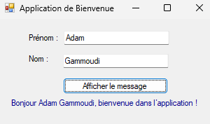
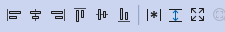
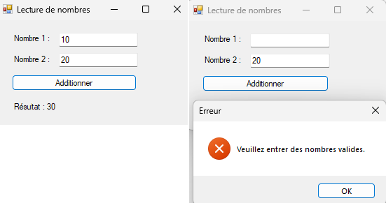
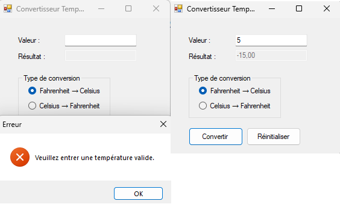
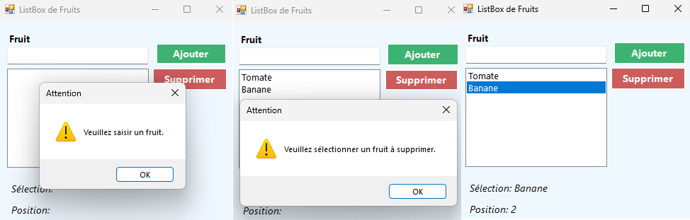
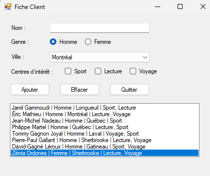

# 🧪 Labo 12.2 – Interface graphique

📎 **Référence** : [Introduction à l'interface graphique (WinForm)](https://info.cegepmontpetit.ca/1P6/cours/winform)
---

## 🟢 Exercice 1 : Créer ma première application **WinForms** 

---

## 🎯 Objectifs de l’exercice :

* Créer une première application WinForm,
* Explorer la structure de l'application,
* Explorer les principales fénètres
* Ajouter des contrôles,
* Changer les propriétés des contrôles,
* Ajouter un évènement
* Récupérer le contenu des contrôles
* Modifier le contenu des contrôles par le code
* Lancer l'application

**Instructions** : Créer un application WinForm qui pernet à l'utilisateur de :
* Entrer son nom et son prénom
* Appuyer sur un bouton pour lui afficher un texte de bienvenue

✅ **Sortie attendue** :


---
## 🧩 Étape 1 – Créer le projet

1. Ouvre **Visual Studio**.
2. Clique sur **Créer un nouveau projet**.
3. Choisis **Application Windows Forms (.NET Framework)** 
4. Clique sur **Suivant**.
5. Donne un nom à ton projet, BienvenueWinForm
6. Choisis un emplacement, puis clique sur **Créer**.

---
### 🔍 Étape 2 Explorer l'environnement 
Avant de commencer à placer des contrôles, prenez un moment pour explorer l’environnement de développement afin de bien comprendre à quoi servent les principales fenêtres.

🔹 Explorateur de solutions

    * 📂 Rôle : affiche la structure du projet (fichiers .cs, formulaires, ressources, etc.).
    * 🔍 Utilité : permet d’ouvrir, renommer ou gérer les fichiers de ton application.
    * 💡 Astuce : si tu ne la vois pas, ouvre-la via Affichage > Explorateur de solutions.

🔹 Fenêtre des propriétés

    * ⚙️ Rôle : affiche et modifie les propriétés du contrôle sélectionné (Formulaire, Label, TextBox, etc.).
    * 🖋️ Utilité : change le texte, le nom (Name), la taille, la couleur, la position, etc.
    * 💡 Astuce : sélectionne un contrôle sur le formulaire et regarde comment ses propriétés changent.

🔹 Boîte à outils (Toolbox)

    * 🧰 Rôle : contient tous les contrôles standards que tu peux glisser sur le formulaire (Label, TextBox, Button, etc.).
    * 🧱 Utilité : c’est à partir de cette boîte que tu construis ton interface graphique.
    * 💡 Astuce : si elle n’est pas visible, ouvre-la via Affichage > Boîte à outils.

## 🧾 Étape 2 – Renommer le formulaire

1. Dans **l’Explorateur de solutions**, clique sur `Form1.cs`.
2. Fais un clic droit → **Renommer** → tape `FrmBienvenue.cs`.
3. Visual Studio te proposera de renommer toutes les références → choisis **Oui**.

---

## 🖼️ Étape 3 – Modifier les propriétés du formulaire

1. Dans **l’Explorateur de solutions**, double-cliquer sur `FrmBienvenue.cs`.
2. Dans la **fenêtre des propriétés** :

   * `Text` → **Bienvenue !**  
   * `Name` → `FrmBienvenue`

---

## 🧱 Étape 4 – Ajouter les contrôles

Dans la **Boîte à outils** (Toolbox) :

1. Fais glisser deux **Label** sur le formulaire pour le prénom et le nom.
2. Fais glisser deux **TextBox** à droite des deux Label.
3. Fais glisser un **Button** .
4. Fais glisser un **Label** pour le message.
4. Redimentionner les contrôles.
---

## 🏷️ Étape 5 – Renommer les contrôles

Sélectionne chaque contrôle et dans la **fenêtre des propriétés** change le nom et le texte:

| Contrôle | Propriété `Name` | Propriété `Text`     |
| -------- | ---------------- | -------------------- |
| Label    | `lblNom`         | `Nom`      |
| TextBox  | `txtNom`         | *(vide)*      |
| Label    | `lbPrenom`       | `Prénom`      |
| TextBox  | `txtPrenom`         | *(vide)*      |
| Button   | `btnAfficher`    | `Afficher le message`     |
| Label    | `lbMessage`       | *(vide)*      |
---

## ⚙️ Étape 6 – Aligner les contrôles
Vous pouvez utiliser ces icônes pour aligner les contrôles ou uniformer leur taille.



💡 **Astuces :**  
- Pour sélectionner plusieurs contrôles, maintenez la touche Ctrl enfoncée et cliquez sur chacun d’eux. 
- Utilisez également les flèches du clavier pour affiner l’espacement.

---

## 💻 Étape 7 – Ajouter un événement Click sur un bouton

1. Double-clique sur le bouton **Afficher le message**.
   → Visual Studio ouvre le code C#.
2. Entre le code nécéssaire à l’intérieur de l’événement `btnAfficher_Click` :

```csharp
private void btnAfficher_Click(object sender, EventArgs e)
{
    // TODO : Récupérer le contenu du contrôle txtPrenom dans une variable prenom;

    // TODO : Récupérer le contenu du contrôle txtNom dans une variable nom;

    // TODO : Modifier le contenu du contrôle lblMessage en mettant comme montré dans la démo.
   
}
```

---

## ▶️ Étape 8 – Tester l’application

1. Appuie sur **F5** ou clique sur **Démarrer**.
2. Tape ton nom et ton prénom dans les zones respectives.
3. Clique sur **Afficher** → le Label doit se mettre à jour avec le message.

---

## 🟢 Exercice 2 : Additionner
---

## 🎯 Objectif de l’exercice :

* Lire et valider des nombres à partir d'un formulaire,
* Utiliser **MessageBox.Show**

**Instructions** : Créer un application WinForm qui pernet à l'utilisateur de :
* Entrer deux nombres
* Additionner les deux nombres et afficher le résultat.
* Afficher un message d'erreur si un nombre est invalide.

✅ **Sortie attendue** :


---
## 🧩 Contrôles à utiliser

| Contrôle | Nom (Name)       | Texte (Text)  | Description             |
| -------- | ---------------- | ------------- | ----------------------- |
| Label    | `lblNombre1`     | `Nombre 1 :`  | —                       |
| TextBox  | `txtNombre1`     | *(vide)*      | pour le premier nombre  |
| Label    | `lblNombre2`     | `Nombre 2 :`  | —                       |
| TextBox  | `txtNombre2`     | *(vide)*      | pour le deuxième nombre |
| Button   | `btnAdditionner` | `Additionner` | lance le calcul         |
| Label    | `lblResultat`    | *(vide)*      | affichera le résultat   |

---
### 🧩 Évènement à programmer

```csharp
private void btnAdditionner_Click(object sender, EventArgs e)
{
    // Récupérer le contenu des deux TextBox dans deux variables

    // Valider les deux valeurs. Au besoin, afficher un message d'erreur avec MessageBox
    
    // Additionner les deux variables 
    
    // Afficher le résultat dans lblResultat
   
}
```

---

## 🟢 Exercice 3 : Convertisseur de température
---

## 🎯 Objectif de l’exercice :

* Utiliser le contrôle RadioButton

**Instructions** : Créer un application WinForm qui pernet à l'utilisateur de :
* Entrer une température
* Choisir le type de conversion (Fahrenheit ou Celsius)
* Convertir et afficher le résultat

📝 Remarque : Le programme doit valider la valeur de la température et afficher un message d'erreur avec **MessageBox.Show**.


✅ **Sortie attendue** :




---
## 🧩 Contrôles à utiliser

| Contrôle | Nom (Name)       | Texte (Description affichée)  | Description et Informations supplémentaires |
| -------- | ---------------- | ------------- |  --------------------------  |
| Label    | `lblValeur`     | `Valeur :`  | Identifie la zone de saisie de la valeur de température à convertir|
| TextBox  | `txtValeur`     | *(vide)*      | Saisie de la valeur de température à convertir|
| Label    | `lblResultat`     | `Résultat :`  | Identifie la zone d'affichage du résultat de la conversion |
| TextBox  | `txtResultat`     | *(vide)*      | Affiche le résultat de la conversion <br/> **ReadOnly = true** <br/> **Enabled = false**|
| GroupBox  | `grpConversion`     | `Type de conversion`  | Regroupe les deux RadioButtons |
| RadioButton  | `rbFtoC`     | `Fahrenheit → Celsius`  | Choix : convertir de Fahrenheit vers Celsius.|
| RadioButton   | `rbCtoF` | `Celsius → Fahrenheit` | Choix : convertir de Celsius vers Fahrenheit.|
| Button   | `btnConvertir` | `Convertir` | Lance la conversion|
| Button   | `btnReinitialiser` | `Réinitialiser` | Réinitialise le formulaire|


---
### 🧩 Évènement à programmer

```csharp
private void btnConvertir_Click(object sender, EventArgs e)
{
    // 1. Lire la valeur entrée par l'utilisateur dans txtValeur
    //    (le texte doit être converti en nombre)
    
    // 2. Vérifier si la valeur est valide, Sinon afficher un message d'erreur et arrêter le traitement
    
       
    // 3. Vérifier quel choix de conversion l'utilisateur a sélectionné
    //    - rdbFtoC est coché : convertir Fahrenheit → Celsius
    //    - rdbCtoF est coché : convertir Celsius → Fahrenheit
    //    - aucun choix       : Afficher un message pour inviter l'utilisateur à faire un choix
    
    // Formules utilisées dans la conversion
    //    - C = (F - 32) * 5 / 9
    //    - F = (C * 9 / 5) + 32
    
    // 4. Afficher le résultat dans txtResultat 
      
}
```
```csharp
private void btnReinitialiser_Click(object sender, EventArgs e)
{
    // 1. Effacer le contenu du contrôle txtValeur
    // 2. Effacer le contenu du contrôle txtResultat
    // 3. Décocher le bouton radio rdbFtoC
    // 4. Décocher le bouton radio rdbCtoF
    // 5. Mettre le focus sur txtValeur pour une nouvelle saisie   
      
}
```
---

## 🟢 Exercice 4 : Mes fruits favoris
---

## 🎯 Objectif de l’exercice :

* Utiliser un ListBox

**Instructions** : Créer un application WinForm qui pernet à l'utilisateur de :
* Rentrer des fruits et les rajouter dans une liste
* Sélectionner et supprimer un fruit dans une liste
* Afficher un message d'erreur si la saisie n'est pas valide
* Afficher un message d'erreur si la selection n'est pas valide dans une liste

✅ **Sortie attendue** :


---
## 🧩 Contrôles à utiliser

| Contrôle | Nom (Name)       | Texte (Description affichée)  | Description et Informations supplémentaires |
| -------- | ---------------- | ------------- |  --------------------------  |
| Label    | `lblFruit`     | `Fruit`  | Identifie la zone de saisie du fruit à rajouter|
| TextBox  | `txtFruit`     | *(vide)*      | Saisie du nom de fruit|
| ListBox | `lstFruits`     | --      | Contient la liste des fruits |
| Button   | `btnAjouter` | `Ajouter` | Ajoute un fruit à la liste|
| Button   | `btnSupprimer` | `Supprimer` | Supprime le fruit sélectionné dans la liste|
| Label    | `lblSelection`     | `Sélection:`  | Affiche le fruit sélectionné|
| Label    | `lblPosition`     | `Position:`  | Affiche la position du fruit sélectionné|

---
### 🧩 Évènement à programmer

```csharp
private void btnAjouter_Click(object sender, EventArgs e)
{
    // 1. Lire la valeur entrée par l'utilisateur dans txtFruit    
    // 2. Vérifier si la valeur est valide, Sinon afficher un message d'erreur et arrêter le traitement          
    // 3. Ajouter la valeur dans le ListBox   
    // 4. Vider txtFruit
    // 5. Mettre le focus sur txtFruit
      
}
```
```csharp
private void btnSupprimer_Click(object sender, EventArgs e)
{
    // 1. Vérifier s'il y a un élément sélectionné dans le ListBox
    //    Afficher un message d'erreur si aucun élément n'est sélectionné et arrêter le traitement
    // 2. Récupérer la position de l'élément sélectionné
    // 3. Supprimer l'élément à cette position dans le ListBox 
      
}
```

```csharp
private void lstFruits_SelectedIndexChanged_Click(object sender, EventArgs e)
{
    // 1. Vérifier s'il y a un élément sélectionné dans le ListBox
    //    Afficher la position de l'élément sélectionné dans lblPosition
    //    Afficher la valeur de l'élément sélectionné (fruit) dans lblSeelection
      
}
```
---

## 🟡 Exercice 5 : Gestion de clients
---

## 🎯 Objectif de l’exercice :

* Utiliser un ComboBox
* Définir des méthodes dans le formulaire

**Instructions** : Créer un application WinForm qui pernet de :
* Rentrer les données d'un client
* Afficher les données du clinet dans une liste
* Supprimer la liste des clients
* Afficher un message d'erreur si la selection n'est pas valide dans une liste
* Quitter l'application

✅ **Sortie attendue** :


---
## 🧩 Contrôles à utiliser

| Contrôle | Nom (Name)       | Texte (Description affichée)  | Description et Informations supplémentaires |
| -------- | ---------------- | ------------- |  --------------------------  |
| Label    | `lblNom`     | `Nom`  | Identifie la zone de saisie du nom de client|
| TextBox  | `txtNom`     | *(vide)*      | Saisie du nom de client|
| Label    | `lblGenre`     | `Genre`  | Identifie la zone de choix du genre|
| RadioButton  | `rbHomme`     | `Homme`     | Choix du genre Homme|
| RadioButton  | `rbFemme`     | `Femme`     | Choix du genre Femme|
| Label    | `lblVille`     | `Ville`  | Identifie la zone de saisie/choix de la ville|
| ComboBox  | `cmbVilles`     |  *(vide)*      | Affiche la liste des villes à choisir|
| Label    | `lblInteret`     | `Centres d'intérêt`  | Identifie la zone de choix des centres d'intérêts|
| CheckBox | `chkSport`     | --      | Choix du centre d'intérêt : Sport |
| CheckBox | `chkLecture`     | --      | Choix du centre d'intérêt : Lecture |
| CheckBox | `chkVoyage`     | --      | Choix du centre d'intérêt : Voyage |
| ListBox | `lstClients`     | --      | Affiche les données de chaque client |
| Button   | `btnAjouter` | `Ajouter` | Ajoute une entrée (données d'un client) dans le ListBox|
| Button   | `btnEffacer` | `Effacer` | Vider le ListBox|
| Button   | `btnQuitter` | `Quitter` | Quitter l'application|


---
### 🧩 Évènement et méthodes à programmer/compléter

```csharp
// Méthode à définir
public void Reinitialiser()
 {
     // Vider le contenu de txtNom
     // Mettre le focus sur txtNom
     // Décocher les boutons pour le choix du genre
     // Positionner l’index sélectionné du ComboBox à -1 (Aucun élément sélectionné)
     // Décocher les choix du centre d'intérêts
     
 }
```

 ```csharp
 // Méthode à compléter
public FrmClient()
 {
    InitializeComponent();
    // Appeler la méthode Reinitialiser
    // Remplir cmbVilles par la liste des villes:
    //  "Montréal", "Québec", "Laval", "Gatineau", "Sherbrooke", "Longueuil"
    
     
 }
```


```csharp
private void btnAjouter_Click(object sender, EventArgs e)
{
    // 1. Lire les données du client (chaque données dans une variable)
    // 2. Rajouter une entrée dans le ListBox (une chaine composée des données du client)         
    // 3. Ajouter la valeur dans le ListBox   
    // Ajouter la méthode Réinitialiser 
      
}
```
```csharp
private void btnSupprimer_Click(object sender, EventArgs e)
{
    // 1. Vérifier s'il y a un élément sélectionné dans le ListBox
    //    Afficher un message d'erreur si aucun élément n'est sélectionné et arrêter le traitement
    // 2. Récupérer la position de l'élément sélectionné
    // 3. Supprimer l'élément à cette position dans le ListBox 
      
}
```

```csharp
private void lstFruits_SelectedIndexChanged_Click(object sender, EventArgs e)
{
    // 1. Vérifier s'il y a un élément sélectionné dans le ListBox
    //    Afficher la position de l'élément sélectionné dans lblPosition
    //    Afficher la valeur de l'élément sélectionné (fruit) dans lblSeelection
      
}
```
---
